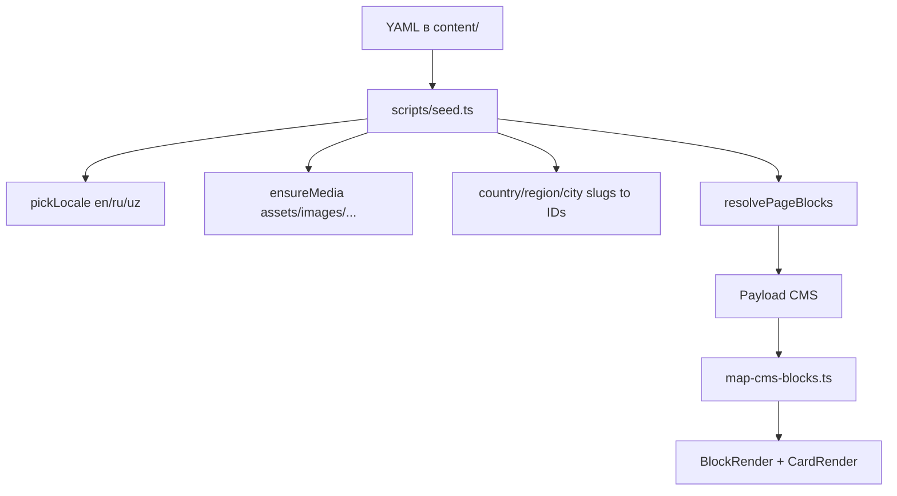

# Справочник блоков и карточек для YAML-сидеров

Документ для проектирования новых сидеров в папке `content/`. Эталонный пример — [`content/countries/uzbekistan.yml`](content/countries/uzbekistan.yml).

**Источники истины в коде:**

| Что | Где |
|-----|-----|
| Блоки CMS | [`src/cms/blocks/`](src/cms/blocks/) |
| Поля карточек | [`src/cms/blocks/card.ts`](src/cms/blocks/card.ts) |
| Рендер UI | [`src/shared/ui/blocks/ui/block-render.tsx`](src/shared/ui/blocks/ui/block-render.tsx), [`src/shared/ui/cards/ui/card-render.tsx`](src/shared/ui/cards/ui/card-render.tsx) |
| Парсинг YAML | [`scripts/seed.ts`](scripts/seed.ts) |
| Маппинг CMS → UI | [`src/cms/lib/map-cms-blocks.ts`](src/cms/lib/map-cms-blocks.ts) |



---

## 1. Общие правила

### Локализация

Поддерживаемые локали: **`en`**, **`ru`**, **`uz`**.

Любое пользовательское текстовое поле — объект с тремя ключами:

```yaml
title:
  en: Uzbekistan
  ru: Узбекистан
  uz: O'zbekiston
```

Функция `pickLocale` в `scripts/seed.ts` рекурсивно разворачивает локализованные объекты при записи в Payload CMS для каждой локали.

**Исключения (не локализуются):**

- `slug` у badges — строка (`UNESCO`, `FEATURED`)
- `segment` у pages — строка (`company`, `help`)
- `country`, `region`, `city` в geo-сущностях — slug-строки (`uzbekistan`, `bukhara-region`)
- `entityType`, `entitySlug` в routeMap stops
- `type` у карточек (`routeIdea`, `country`)
- `gridClassName`, `email`, `phone`, `href` (кроме локализованных `title` в actions)
- enum-поля attractions: `type`, `importance`

### Slug

Slug — локализованный объект. **Канонический ключ** для связей, routeMap и lookup — значение **`slug.en`**.

Если `slug.en` отсутствует, seed использует имя файла без `.yml`.

```yaml
slug:
  en: uzbekistan
  ru: uzbekistan
  uz: uzbekistan
```

### Rich text

В YAML описания — обычные строки (допускаются переносы `\n` и маркированные списки). При seed строки конвертируются в Lexical rich text через `toDefaultRichText` / `normalizeRichTextDescriptions`.

Поля rich text: `description` в блоках и карточках, `content` на уровне документа (если используется).

### Изображения

Путь от корня репозитория:

```yaml
heroImage: assets/images/destinations/uzbekistan.jpg
image: assets/images/city/samarkand.jpg
```

Seed загружает файлы в коллекцию `media` и подставляет ID. Файл должен существовать в `assets/images/`.

### Badges (уровень документа)

Массив slug-строк из [`content/badges.yml`](content/badges.yml):

| slug | title.en |
|------|----------|
| `UNESCO` | UNESCO World Heritage |
| `TOP_PICK` | Top pick |
| `MUST_SEE` | Must see |
| `EDITOR_CHOICE` | Editor's choice |
| `POPULAR` | Popular |
| `HIDDEN_GEM` | Hidden gem |
| `NEW` | New |
| `TRENDING` | Trending |
| `FEATURED` | Featured |

```yaml
badges:
  - FEATURED
  - TOP_PICK
  - UNESCO
```

Badges с `FEATURED` или `TOP_PICK` получают `navOrder: -1` при seed (если `navOrder` не задан явно).

### Порядок элементов

Порядок блоков, карточек, stops на карте и вопросов FAQ = **порядок в массиве YAML**. Отдельных полей `order` / `index` / `position` нет.

---

## 2. Типы контент-файлов

### Таблица коллекций

| Папка / файл | Коллекция Payload | Специфичные поля |
|--------------|-------------------|------------------|
| `content/countries/*.yml` | `countries` | `mapCenter`, `heroImage`, `badges`, `blocks` |
| `content/regions/*.yml` | `regions` | `country` (slug), `mapCenter`, `blocks` |
| `content/cities/*.yml` | `cities` | `country`, `region`, `latitude`, `longitude`, `blocks` |
| `content/attractions/*.yml` | `attractions` | `country`, `region`, `city`, `type`, `importance`, coords, `blocks` |
| `content/pages/*.yml` | `pages` | `segment` (slug), `slug`, `blocks` |
| `content/main-page.yml` | global `homepage` | `seo`, `blocks` |
| `content/destination-page.yml` | global `destination` | `seo`, `blocks` |
| `content/themes.yml` | `themes` | `icon`, `description`, `blocks`, `seo` |
| `content/badges.yml` | `badges` | массив badge-объектов |
| `content/segments.yml` | `segments` | массив segment-объектов |

### Общие поля сущностей

```yaml
slug:          # { en, ru, uz } — обязателен
title:         # { en, ru, uz } — обязателен
subtitle:      # { en, ru, uz } — опционально
excerpt:       # { en, ru, uz } — опционально
heroImage:     # путь к assets — опционально
blocks:        # массив блоков — обязателен для geo/pages/themes
seo:
  metaTitle:   # { en, ru, uz }
  metaDescription: # { en, ru, uz }
  structuredDataType: TouristDestination  # опционально
status:
  showInSitemap: true
  noindex: false
  publishedAt: "2025-06-01"
```

### Иерархия связей (строковые slug, не ID)

```
country (uzbekistan)
  └── region (bukhara-region)
        └── city (bukhara)
              └── attraction (ark-fortress)
```

В YAML:

```yaml
# region
country: uzbekistan

# city
country: uzbekistan
region: bukhara-region
latitude: 39.7681
longitude: 64.4556

# attraction
country: uzbekistan
region: bukhara-region
city: bukhara
latitude: 39.7750
longitude: 64.4142
type: FORTRESS
importance: MUST_SEE
```

### Порядок seed

1. badges, segments, themes
2. countries
3. regions (нужны country slug)
4. cities (нужны country + region slug)
5. attractions (нужны country + region + city slug)
6. **refreshRouteMapStops** — резолвит `entitySlug` → ID для routeMap
7. pages, homepage, destination global

При первичном создании geo-документов routeMap stops **откладываются** (`deferRouteMapStops: true`) и заполняются на втором проходе.

---

## 3. Блоки (`blockType`)

Доступные значения: `hero`, `overviewStats`, `regular`, `routeMap`, `faq`, `cta`.

Блоки рендерятся компонентом `BlockRender`. Блок `regular` без карточек — секция только с заголовком и текстом.

---

### 3.1 `hero`

**UI:** полноширинный hero-баннер (`CustomPageHero`).

**Поля:**

| Поле | Тип | Обязательно | Локализация |
|------|-----|-------------|-------------|
| `image` | путь к assets | да | нет |
| `imageAlt` | string | нет | да |
| `title` | string | да | да |
| `description` | string (rich text) | нет | да |
| `note` | string | нет | да |
| `actions` | массив actions | нет | title локализован |

**Пример:**

```yaml
- blockType: hero
  image: assets/images/destinations/uzbekistan.jpg
  imageAlt:
    en: Uzbekistan
    ru: Узбекистан
    uz: O'zbekiston
  title:
    en: Uzbekistan
    ru: Узбекистан
    uz: O'zbekiston
  description:
    en: Samarkand, Bukhara, Khiva and Tashkent — the richest Silk Road circuit in Central Asia.
    ru: Самарканд, Бухара, Хива и Ташкент — самый насыщенный маршрут по Великому шёлковому пути в Центральной Азии.
    uz: Samarqand, Buxoro, Xiva va Toshkent — Markaziy Osiyodagi eng boy Ipak yo'li marshruti.
  note:
    en: TourLink is based here — the natural starting point for a first Central Asia trip.
    ru: TourLink базируется здесь — естественная точка старта для первой поездки по Центральной Азии.
    uz: TourLink shu yerda joylashgan — Markaziy Osiyoga birinchi sayohat uchun tabiiy boshlang'ich nuqta.
  actions:
    - type: mailto
      variant: default
      title:
        en: Request a tour
        ru: Запросить тур
        uz: Tur so'rash
      email: info@tourlink.uz
```

---

### 3.2 `overviewStats`

**UI:** горизонтальная полоса статистики/фактов (`OverviewStatsSection`).

**Ограничение:** в `cards[]` допускаются **только** карточки `type: overviewStat`.

**Поля блока:**

| Поле | Тип | Обязательно |
|------|-----|-------------|
| `cards` | массив overviewStat | да |

**Пример:**

```yaml
- blockType: overviewStats
  cards:
    - type: overviewStat
      icon: map-pin
      value:
        en: Team in Tashkent
        ru: Команда в Ташкенте
        uz: Toshkentdagi jamoa
    - type: overviewStat
      icon: globe-2
      value:
        en: Routes across the region
        ru: Маршруты по региону
        uz: Mintaqadagi marshrutlar
```

---

### 3.3 `regular`

**UI:** секция с заголовком, описанием, опциональными кнопками и сеткой карточек (`CardsSection`).

**Поля:**

| Поле | Тип | Обязательно | Локализация |
|------|-----|-------------|-------------|
| `eyebrow` | string | нет | да |
| `title` | string | да | да |
| `description` | string (rich text) | нет | да |
| `gridClassName` | Tailwind classes | нет | нет |
| `actions` | массив actions | нет | title локализован |
| `cards` | массив карточек | нет | зависит от типа |

**Типичные `gridClassName`:**

- `sm:grid-cols-2 lg:grid-cols-2` — 2 колонки
- `sm:grid-cols-2 lg:grid-cols-3` — 3 колонки
- `md:grid-cols-2 lg:grid-cols-4` — 4 колонки (форматы поездок, сезоны)

**Пример (секция без карточек):**

```yaml
- blockType: regular
  eyebrow:
    en: About
    ru: О стране
    uz: Mamlakat haqida
  title:
    en: Uzbekistan
    ru: Узбекистан
    uz: O'zbekiston
  description:
    en: "Uzbekistan compresses centuries of Islamic architecture and Silk Road history into a week of fast trains."
    ru: "Узбекистан собирает вековую исламскую архитектуру и историю Шёлкового пути в маршрут на неделю на скоростных поездах."
    uz: "O'zbekiston asrlar davomida shakllangan islom me'morchiligi va Ipak yo'li tarixini bir haftalik tezkor poezd marshrutiga jamlaydi."
```

**Пример (секция с карточками):**

```yaml
- blockType: regular
  eyebrow:
    en: Regions
    ru: Регионы
    uz: Hududlar
  title:
    en: Where to go in Uzbekistan
    ru: Куда ехать в Узбекистане
    uz: O'zbekistonda qayerga borish kerak
  description:
    en: The classic Silk Road circuit runs through Tashkent, Samarkand, Bukhara and Khiva.
    ru: Классический шёлковый маршрут проходит через Ташкент, Самарканд, Бухару и Хиву.
    uz: Klassik Ipak yo'li aylanasi Toshkent, Samarqand, Buxoro va Xiva orqali o'tadi.
  gridClassName: sm:grid-cols-2 lg:grid-cols-2
  cards:
    - type: routeIdea
      image: assets/images/city/samarkand.jpg
      badge:
        en: Must see
        ru: Must see
        uz: Ko'rish shart
      meta:
        en: UNESCO · Afrosiyob train
        ru: ЮНЕСКО · Поезд Афросиёб
        uz: YUNESKO · Afrosiyob poyezdi
      title:
        en: Samarkand
        ru: Самарканд
        uz: Samarqand
      description:
        en: Registan, Shah-i-Zinda and Timurid architecture at the heart of the Silk Road.
        ru: Регистан, Шахи-Зинда и архитектура эпохи Тимуридов в сердце Шёлкового пути.
        uz: Registon, Shohi Zinda va Ipak yo'lining markazidagi temuriylar me'morchiligi.
      ctaHref: /destinations/uzbekistan/samarkand-region
      ctaLabel:
        en: Explore region
        ru: Смотреть регион
        uz: Viloyatni ko'rish
```

---

### 3.4 `routeMap`

**UI:** интерактивная карта Leaflet с точками маршрута (`RouteMapView`).

**Поля:**

| Поле | Тип | Обязательно | Локализация |
|------|-----|-------------|-------------|
| `eyebrow` | string | нет | да |
| `title` | string | нет | да |
| `description` | string | нет | да |
| `mapCenter.latitude` | number | нет | нет |
| `mapCenter.longitude` | number | нет | нет |
| `zoom` | number | нет | нет |
| `stops` | массив stops | нет | нет |

**Stop в YAML** (не `relation` — это поле CMS после seed):

| Поле | Значения |
|------|----------|
| `entityType` | `country` \| `region` \| `city` \| `attraction` |
| `entitySlug` | slug.en сущности из соответствующей коллекции |

Координаты точки на карте берутся автоматически:

- `city`, `attraction` → `latitude` / `longitude`
- `country`, `region` → `mapCenter.latitude` / `mapCenter.longitude`

**Пример:**

```yaml
- blockType: routeMap
  eyebrow:
    en: Routes
    ru: Маршруты
    uz: Marshrutlar
  title:
    en: How a classic Uzbekistan route flows
    ru: Как обычно строится классический маршрут по Узбекистану
    uz: O'zbekiston bo'ylab klassik yo'nalish qanday quriladi
  description:
    en: Tashkent is the usual entry point; Afrosiyob trains connect the main Silk Road cities in hours.
    ru: Ташкент обычно служит точкой входа, а поезда «Афросиёб» быстро связывают главные города Шёлкового пути.
    uz: Toshkent odatda kirish nuqtasi bo'ladi, Afrosiyob poyezdlari esa Ipak yo'lining asosiy shaharlarini tez bog'laydi.
  mapCenter:
    latitude: 41.2
    longitude: 64.5
  zoom: 6
  stops:
    - entityType: region
      entitySlug: tashkent-region
    - entityType: region
      entitySlug: samarkand-region
    - entityType: region
      entitySlug: bukhara-region
    - entityType: region
      entitySlug: khorezm-region
```

**Важно:** все `entitySlug` должны существовать к моменту `refreshRouteMapStops`. Порядок stops = порядок следования по маршруту.

---

### 3.5 `faq`

**UI:** аккордеон вопросов (`FaqSection`).

**Поля блока:**

| Поле | Тип | Обязательно | Локализация |
|------|-----|-------------|-------------|
| `eyebrow` | string | нет | да |
| `title` | string | да | да |
| `description` | string | нет | да |
| `questions` | массив | нет | да |

**Поля вопроса:**

| Поле | Тип | Обязательно | Локализация |
|------|-----|-------------|-------------|
| `icon` | Lucide string | да | нет |
| `title` | string | да | да |
| `description` | string (rich text) | да | да |

**Пример:**

```yaml
- blockType: faq
  eyebrow:
    en: Routes in detail
    ru: Маршруты в деталях
    uz: Marshrut tafsilotlari
  title:
    en: How route pacing works in practice
    ru: Как темп маршрута работает на практике
    uz: Marshrut tempi amalda qanday ishlaydi
  description:
    en: Use these accordion notes to brief clients on transfer times and overnight logic.
    ru: "Аккордеон для брифа клиентов: переезды, ночёвки и логика дней."
    uz: Mijozlarga transfer va tunlash mantiqini tushuntirish uchun akkordeon.
  questions:
    - icon: CalendarDays
      title:
        en: How many nights are ideal for first-time Uzbekistan?
        ru: Сколько ночей оптимально для первой поездки в Узбекистан?
        uz: O'zbekistonga birinchi safar uchun necha tun optimal?
      description:
        en: "Most first programs work best with 7-10 nights: Tashkent arrival, 2 nights Samarkand, 2 nights Bukhara, and optional Khiva extension."
        ru: "Для первой программы обычно хватает 7–10 ночей: прилёт в Ташкент, 2 ночи в Самарканде, 2 в Бухаре и опционально Хива."
        uz: "Birinchi dastur uchun odatda 7–10 tun yetadi: Toshkentga kelish, Samarqandda 2 tun, Buxoroda 2 tun va ixtiyoriy Xiva kengaytmasi."
    - icon: Train
      title:
        en: Where are long transfers and how do we soften them?
        ru: Где длинные переезды и как их смягчить?
        uz: Qayerda uzoq ko'chalar bor va ularni qanday yumshatish mumkin?
      description:
        en: Tashkent-Samarkand-Bukhara is efficient by Afrosiyob. The long leg is typically Bukhara-Khiva.
        ru: "Связка Ташкент–Самарканд–Бухара удобна на «Афросиёбе». Длинный плечо — обычно Бухара–Хива."
        uz: "Toshkent–Samarqand–Buxoro Afrosiyob bilan qulay. Uzoq parcha odatda Buxoro–Xiva."
```

---

### 3.6 `cta`

**UI:** баннер призыва к действию (`CustomCtaBanner`).

**Поля:**

| Поле | Тип | Обязательно | Локализация |
|------|-----|-------------|-------------|
| `image` | путь к assets | нет | нет |
| `eyebrow` | string | нет | да |
| `title` | string | нет | да |
| `description` | string | нет | да |
| `actions` | массив actions | нет | title локализован |

**Пример:**

```yaml
- blockType: cta
  image: assets/images/destinations/uzbekistan.jpg
  eyebrow:
    en: Tailor-made
    ru: Под запрос
    uz: Individual
  title:
    en: Plan your Uzbekistan route with TourLink
    ru: Спланируйте маршрут по Узбекистану с TourLink
    uz: TourLink bilan O'zbekiston marshrutini rejalashtiring
  description:
    en: We help agencies build realistic Silk Road itineraries — trains, pacing, and local logistics included.
    ru: Помогаем агентствам собирать реалистичные программы по Шёлковому пути — поезда, темп и локальная логистика включены.
    uz: Agentliklar uchun realistik Ipak yo'li dasturlarini yig'amiz — poezdlar, temp va mahalliy logistika bilan.
  actions:
    - type: mailto
      variant: default
      title:
        en: Discuss a route
        ru: Обсудить маршрут
        uz: Marshrutni muhokama qilish
      email: info@tourlink.uz
    - type: link
      variant: outline
      title:
        en: Browse catalog
        ru: Открыть каталог
        uz: Katalogni ko'rish
      href: /catalog?destination=Uzbekistan
```

---

## 4. Actions (кнопки)

Используются в блоках `hero`, `regular`, `cta`.

| type | Поля | Примечание |
|------|------|------------|
| `mailto` | `title`, `email`, `variant?` | Открывает почтовый клиент |
| `link` | `title`, `href`, `variant?`, `target?` | `target`: `_self` (default) или `_blank` |
| `tel` | `title`, `phone`, `variant?` | На фронте → `tel:{phone}` |

**variant:** `default` | `destructive` | `outline` | `secondary` | `ghost` | `link`

### Префиксация href при seed

На `destination-page` относительные slug без `/` превращаются в полный путь:

```yaml
# В YAML destination-page.yml:
href: uzbekistan
# После seed:
href: /destinations/uzbekistan
```

Правило: если `href` не начинается с `#`, `/` и не содержит `://` — добавляется префикс `/{destinationPageSlug}/`.

Для `routeIdea` с `countrySlug` (без явного `ctaHref`):

```yaml
- type: routeIdea
  countrySlug: uzbekistan
  # seed генерирует: ctaHref: /destinations/uzbekistan
```

---

## 5. Карточки (`type` в `cards[]`)

Все карточки рендерятся через `CardRender`. Поле `type` обязательно.

### Сводная таблица

| type | Где используется | Изображение | Иконка | Seed-особенности |
|------|------------------|-------------|--------|------------------|
| `country` | regular | из БД | — | Только `countrySlug`; данные из страны |
| `routeIdea` | regular | да | — | `countrySlug` → auto `ctaHref` |
| `destinationInsight` | regular | нет | да | — |
| `experience` | regular | да | — | — |
| `tripFormat` | regular | нет | да | — |
| `overviewStat` | overviewStats only | нет | да | — |
| `tradeFair` | regular | нет | — | — |
| `journal` | regular | да | — | — |
| `servicesProcess` | regular | нет | — | — |
| `servicesBusiness` | regular | нет | да | Нет примеров в YAML |
| `servicesDirection` | regular | да | — | Нет примеров в YAML |

**Не сидируются через blocks** (хардкод виджетов): `contact-detail`, `about-*` карточки.

### Иконки (Lucide)

Строка в поле `icon`. Поддерживаются форматы: `Compass`, `map-pin`, `Train`, `calendar-days`.

Резолв: [`src/shared/lib/get-lucide-icon.ts`](src/shared/lib/get-lucide-icon.ts). Неизвестная иконка → `HelpCircle`.

Часто используемые: `Train`, `Compass`, `Map`, `Globe`, `CalendarDays`, `Mountain`, `Users`, `Briefcase`, `Heart`, `User`, `Target`, `Link2`, `ShieldCheck`.

---

### 5.1 `country`

**UI:** `CountryCard` — карточка страны с изображением, badge, заголовком, описанием.

**Поля в YAML:**

| Поле | Тип | Обязательно |
|------|-----|-------------|
| `type` | `"country"` | да |
| `countrySlug` | slug.en страны | да |
| `featured` | boolean | нет |

**Не указывать вручную:** `title`, `image`, `href`, `description`, `badge` — seed подтягивает из документа страны (`title`, `heroImage`, `excerpt`, `subtitle`).

```yaml
- type: country
  countrySlug: uzbekistan
  featured: true
- type: country
  countrySlug: kazakhstan
```

---

### 5.2 `routeIdea`

**UI:** `RouteIdeaCard` — карточка маршрута/региона с фото, badge, meta, CTA-кнопкой.

| Поле | Локализация |
|------|-------------|
| `image` | нет |
| `badge` | да |
| `meta` | да |
| `title` | да |
| `description` | да |
| `ctaHref` | нет |
| `ctaLabel` | да |
| `countrySlug` | нет (альтернатива ctaHref) |

```yaml
- type: routeIdea
  image: assets/images/city/samarkand.jpg
  badge:
    en: 7-9 days
    ru: 7–9 дней
    uz: 7–9 kun
  meta:
    en: Best seller
    ru: Хит продаж
    uz: Eng ko'p sotiladi
  title:
    en: Classic Golden Triangle
    ru: Классический Золотой треугольник
    uz: Klassik Oltin uchburchak
  description:
    en: Tashkent, Samarkand and Bukhara for first-time Silk Road demand.
    ru: Ташкент, Самарканд и Бухара — базовый маршрут для первого знакомства с Шёлковым путём.
    uz: Toshkent, Samarqand va Buxoro — Ipak yo'li bilan ilk tanishuv uchun asosiy marshrut.
  ctaHref: /destinations/uzbekistan/samarkand-region
  ctaLabel:
    en: Explore region
    ru: Смотреть регион
    uz: Viloyatni ko'rish
```

С `countrySlug` (без `ctaHref`):

```yaml
- type: routeIdea
  countrySlug: kyrgyzstan
  image: assets/images/destinations/kirgizstan.jpg
  title:
    en: Silk Road cities and mountain roads
    ru: Города Шёлкового пути и горные дороги
    uz: Buyo'ldoq yo'li shaharlari va tog' yo'llari
  description:
    en: Connect Uzbekistan with Kyrgyzstan when an urban route needs mountain air.
    ru: Соедините Узбекистан с Кыргызстаном, когда городскому маршруту нужен горный воздух.
    uz: Shahar marshruti tog' havo talab qilganda O'zbekistonni Qirg'iziston bilan bog'lang.
  ctaLabel:
    en: Plan a trip
    ru: Спланировать поездку
    uz: Sayohatni rejalashtirish
```

---

### 5.3 `destinationInsight`

**UI:** `DestinationInsightCard` — текстовая карточка с иконкой (без изображения).

| Поле | Локализация |
|------|-------------|
| `icon` | нет |
| `title` | да |
| `description` | да |

```yaml
- type: destinationInsight
  icon: Train
  title:
    en: Classic rail backbone
    ru: Классическая связка
    uz: Klassik bog'lama
  description:
    en: Tashkent, Samarkand and Bukhara are best connected by train.
    ru: "Ташкент, Самарканд и Бухара хорошо соединяются поездом."
    uz: "Toshkent, Samarqand va Buxoro poyezd bilan yaxshi bog'langan."
```

---

### 5.4 `experience`

**UI:** `ExperienceCard` — карточка впечатления с фото.

| Поле | Локализация |
|------|-------------|
| `image` | нет |
| `badge` | да |
| `title` | да |
| `description` | да |

```yaml
- type: experience
  image: assets/images/experiences/culture-1.jpg
  badge:
    en: Culture
    ru: Культура
    uz: Madaniyat
  title:
    en: Historical walks
    ru: Исторические прогулки
    uz: Tarixiy sayr
  description:
    en: In a historic city, tiles and courtyard shade stop being separate details when a guide connects them to the street around you.
    ru: В историческом городе изразцы и тень во дворе перестают быть отдельными деталями, когда гид связывает их с улицей вокруг вас.
    uz: Tarixiy shaharda kafel va hovli soyasi alohida tafsilot emas — gid ularni atrofdagi ko'chaga bog'laganda.
```

---

### 5.5 `tripFormat`

**UI:** `TripFormatCard` — карточка формата поездки или сезона с иконкой и badge.

| Поле | Локализация |
|------|-------------|
| `icon` | нет |
| `badge` | да |
| `title` | да |
| `description` | да |

```yaml
- type: tripFormat
  icon: user
  badge:
    en: Private
    ru: Частный
    uz: Shaxsiy
  title:
    en: Private tours
    ru: Частные туры
    uz: Shaxsiy turlar
  description:
    en: Dates, pace, and interests shape the trip.
    ru: Даты, темп и интересы формируют поездку.
    uz: Sanalar, ritm va qiziqishlar sayohat shaklini belgilaydi.
```

---

### 5.6 `overviewStat`

**UI:** `OverviewStatCard` — компактный факт с иконкой.

**Только в блоке `overviewStats`.**

| Поле | Локализация |
|------|-------------|
| `icon` | нет |
| `value` | да |

```yaml
- type: overviewStat
  icon: gauge
  value:
    en: Thoughtful pace
    ru: Продуманный темп
    uz: O'ylangan ritm
```

---

### 5.7 `tradeFair`

**UI:** `TradeFairCard` — карточка выставки (без изображения).

| Поле | Локализация |
|------|-------------|
| `title` | да |
| `stand` | да |
| `country` | да (страна проведения, не slug) |
| `participants` | да |

```yaml
- type: tradeFair
  title:
    en: Uzbekistan stand
    ru: Стенд Узбекистана
    uz: O'zbekiston stendi
  stand:
    en: Stand UZ-12
    ru: Стенд UZ-12
    uz: Stend UZ-12
  participants:
    en: "Participants: Subin Kang, Eldor Keldibekov"
    ru: "Участники: Subin Kang, Eldor Keldibekov"
    uz: "Ishtirokchilar: Subin Kang, Eldor Keldibekov"
  country:
    en: Germany
    ru: Германия
    uz: Germaniya
```

---

### 5.8 `journal`

**UI:** `JournalCard` — карточка заметки/статьи.

| Поле | Локализация |
|------|-------------|
| `image` | нет |
| `meta` | да |
| `title` | да |

```yaml
- type: journal
  image: assets/images/destinations/uzbekistan.jpg
  meta:
    en: Route note · 5 min
    ru: Заметка с маршрута · 5 минут
    uz: Marshrut qaydi · 5 daqiqa
  title:
    en: When the square grows quiet
    ru: Когда площадь становится тихой
    uz: Maydon qachon tinchlanadi
```

---

### 5.9 `servicesProcess`

**UI:** `ServicesProcessCard` — шаг процесса (номер + заголовок + описание).

| Поле | Локализация |
|------|-------------|
| `step` | нет (строка `"01"`, `"02"`) |
| `title` | да |
| `description` | да |

```yaml
- type: servicesProcess
  step: "01"
  title:
    en: Request
    ru: Запрос
    uz: So'rov
  description:
    en: Send your goal, countries, dates, headcount, languages and any meetings already fixed.
    ru: Отправьте цель, страны, даты, количество людей, языки и уже зафиксированные встречи.
    uz: Maqsad, mamlakatlar, sanalar, odamlar soni, tillar va belgilangan uchrashuvlarni yuboring.
```

---

### 5.10 `servicesBusiness`

**UI:** `ServicesBusinessCard` — карточка бизнес-услуги с иконкой.

Поддержан в CMS, **примеров в YAML пока нет**.

| Поле | Локализация |
|------|-------------|
| `icon` | нет |
| `badge` | да |
| `title` | да |
| `description` | да |
| `className` | нет (доп. Tailwind) |

```yaml
- type: servicesBusiness
  icon: briefcase
  badge:
    en: MICE
    ru: MICE
    uz: MICE
  title:
    en: Corporate events
    ru: Корпоративные мероприятия
    uz: Korporativ tadbirlar
  description:
    en: Full coordination for conferences and incentive programs.
    ru: Полная координация конференций и incentive-программ.
    uz: Konferensiyalar va insentiv dasturlarini to'liq muvofiqlashtirish.
```

---

### 5.11 `servicesDirection`

**UI:** `ServicesDirectionCard` — направление услуги с изображением и CTA.

Поддержан в CMS, **примеров в YAML пока нет**.

| Поле | Локализация |
|------|-------------|
| `image` | нет |
| `title` | да |
| `description` | да |
| `ctaLabel` | да |

```yaml
- type: servicesDirection
  image: assets/images/hero-image.jpg
  title:
    en: Private guides
    ru: Частные гиды
    uz: Shaxsiy gidlar
  description:
    en: Matched to city, theme, language and pace of a specific day.
    ru: Под город, тему, язык и темп конкретного дня.
    uz: Shahar, mavzu, til va aniq kun tempiga mos.
  ctaLabel:
    en: Learn more
    ru: Подробнее
    uz: Batafsil
```

---

## 6. SEO и status

### SEO (`seo`)

| Поле | Локализация | Описание |
|------|-------------|----------|
| `metaTitle` | да | `<title>` страницы |
| `metaDescription` | да | meta description |
| `canonicalOverride` | нет | Переопределение canonical URL |
| `ogTitle` | да | Open Graph title |
| `ogDescription` | да | Open Graph description |
| `ogImage` | нет | Путь к assets |
| `robotsNoindex` | да | boolean |
| `structuredDataType` | да | Schema.org тип |

**structuredDataType:** `WebPage` | `TouristDestination` | `TouristAttraction` | `TouristTrip` | `Article`

Рекомендации:

- countries, regions, cities → `TouristDestination`
- attractions → `TouristAttraction`
- pages → `WebPage`

### Status (`status`)

| Поле | Тип | Default |
|------|-----|---------|
| `showInSitemap` | boolean | `true` |
| `noindex` | boolean | `false` |
| `publishedAt` | date string | — |

---

## 7. Enums для attractions

### type

`LANDMARK` | `MUSEUM` | `MOSQUE` | `MADRASA` | `MAUSOLEUM` | `FORTRESS` | `PALACE` | `BAZAAR` | `PARK` | `GARDEN` | `SQUARE` | `LAKE` | `MOUNTAIN` | `VIEWPOINT` | `CULTURAL_SITE` | `NATURAL_SITE` | `RELIGIOUS_SITE`

### importance

`MUST_SEE` | `RECOMMENDED` | `OPTIONAL`

---

## 8. Справочники segments, themes, pages

### Segments ([`content/segments.yml`](content/segments.yml))

| slug | title.en |
|------|----------|
| `company` | Company |
| `legal` | Legal |
| `help` | Help |
| `partners` | Partners |

### Pages ([`content/pages/`](content/pages/))

| segment | slug | Файл |
|---------|------|------|
| company | about | company-about.yml |
| company | services | company-services.yml |
| company | news | company-news.yml |
| company | feedback | company-feedback.yml |
| company | partnership | company-partnership.yml |
| help | contact | help-contact.yml |
| help | faq | help-faq.yml |
| help | support | help-support.yml |
| help | training | help-training.yml |
| help | more-info | help-more-info.yml |
| legal | privacy | legal-privacy.yml |
| legal | terms | legal-terms.yml |
| legal | cookies | legal-cookies.yml |
| legal | booking | legal-booking.yml |
| legal | cancellation | legal-cancellation.yml |
| partners | agencies | partners-agencies.yml |
| partners | hotels | partners-hotels.yml |

URL страницы: `/{segment}/{slug}` (напр. `/company/about`, `/help/contact`).

### Themes ([`content/themes.yml`](content/themes.yml))

| slug.en | title.en |
|---------|----------|
| culture | Culture |
| crafts | Crafts |
| food | Food |
| nature | Nature |
| silk-road | Silk Road |
| architecture | Architecture |
| sacred-heritage | Sacred heritage |
| desert | Desert & oasis |
| mountains | Mountains |
| history | History |
| bazaars | Bazaars |
| adventure | Adventure |
| wellness | Wellness |
| festivals | Festivals & events |
| nomadic-life | Nomadic life |
| art | Art & museums |
| photography | Photography |
| family | Family travel |
| urban-life | Urban life |
| wine-gastronomy | Wine & gastronomy |
| textiles | Textiles & silk |
| archaeology | Archaeology |
| lakes-rivers | Lakes & rivers |
| stargazing | Stargazing |

---

## 9. Каталог geo-сущностей

### Страны (`content/countries/`)

| slug.en | title.en | Файл |
|---------|----------|------|
| `uzbekistan` | Uzbekistan | uzbekistan.yml |
| `kazakhstan` | Kazakhstan | kazakhstan.yml |
| `kyrgyzstan` | Kyrgyzstan | kyrgyzstan.yml |
| `tajikistan` | Tajikistan | tajikistan.yml |
| `turkmenistan` | Turkmenistan | turkmenistan.yml |

### Регионы (`content/regions/`) — все `country: uzbekistan`

| slug.en | title.en | Файл |
|---------|----------|------|
| `tashkent-region` | Tashkent & Chimgan | tashkent-region.yml |
| `samarkand-region` | Samarkand Region | samarkand-region.yml |
| `bukhara-region` | Bukhara Region | bukhara-region.yml |
| `khorezm-region` | Khorezm Region | khorezm-region.yml |

### Города (`content/cities/`)

| slug.en | title.en | country | region |
|---------|----------|---------|--------|
| `tashkent` | Tashkent | uzbekistan | tashkent-region |
| `chimgan` | Chimgan | uzbekistan | tashkent-region |
| `samarkand` | Samarkand | uzbekistan | samarkand-region |
| `bukhara` | Bukhara | uzbekistan | bukhara-region |
| `khiva` | Khiva | uzbekistan | khorezm-region |

### Достопримечательности (`content/attractions/`)

| slug.en | title.en | city | region | type | importance |
|---------|----------|------|--------|------|------------|
| `registan` | Registan | samarkand | samarkand-region | LANDMARK | MUST_SEE |
| `ark-fortress` | Ark Fortress | bukhara | bukhara-region | FORTRESS | — |
| `itchan-kala` | Itchan Kala | khiva | khorezm-region | LANDMARK | — |
| `chorsu-bazaar` | Chorsu Bazaar | tashkent | tashkent-region | BAZAAR | — |
| `khazrati-imam-complex` | Khazrati Imam Complex | tashkent | tashkent-region | RELIGIOUS_SITE | — |
| `amir-timur-square` | Amir Timur Square | tashkent | tashkent-region | SQUARE | — |
| `charvak-reservoir` | Charvak Reservoir | chimgan | tashkent-region | LAKE | MUST_SEE |
| `chimgan-cable-car` | Chimgan Cable Car | chimgan | tashkent-region | VIEWPOINT | — |
| `chimgan-peak` | Chimgan Peak | chimgan | tashkent-region | MOUNTAIN | — |
| `beldersay-resort` | Beldersay Resort | chimgan | tashkent-region | NATURAL_SITE | — |
| `beldersay-gorge` | Beldersay Gorge | chimgan | tashkent-region | NATURAL_SITE | — |

### URL-паттерны для ссылок

| Сущность | Паттерн | Пример |
|----------|---------|--------|
| Страна | `/destinations/{countrySlug}` | `/destinations/uzbekistan` |
| Регион | `/destinations/{countrySlug}/{regionSlug}` | `/destinations/uzbekistan/samarkand-region` |
| Город | по slug города в роутинге приложения | — |
| Достопримечательность | по slug attraction в роутинге приложения | — |
| Каталог | `/catalog?destination={CountryName}` | `/catalog?destination=Uzbekistan` |
| Destinations hub | `/destinations` | — |

---

## 10. Шаблон country-сидера

Минимальный скелет новой страны. Замените тексты, slug, координаты и stops.

```yaml
# Seed: countries — {CountryName}

slug:
  en: country-slug
  ru: country-slug
  uz: country-slug
title:
  en: Country Name
  ru: Название страны
  uz: Mamlakat nomi
subtitle:
  en: Short tagline
  ru: Короткий слоган
  uz: Qisqa shior
excerpt:
  en: One-line summary for cards and meta.
  ru: Однострочное описание для карточек и meta.
  uz: Kartochkalar va meta uchun bir qatorli tavsif.
mapCenter:
  latitude: 41.2995
  longitude: 69.2401
heroImage: assets/images/destinations/country-slug.jpg
badges:
  - FEATURED
blocks:
  - blockType: hero
    image: assets/images/destinations/country-slug.jpg
    imageAlt:
      en: Country Name
      ru: Название страны
      uz: Mamlakat nomi
    title:
      en: Country Name
      ru: Название страны
      uz: Mamlakat nomi
    description:
      en: Hero description — 1-2 sentences.
      ru: Описание hero — 1-2 предложения.
      uz: Hero tavsifi — 1-2 gap.
    note:
      en: Optional contextual note.
      ru: Опциональная контекстная заметка.
      uz: Ixtiyoriy kontekstli eslatma.
    actions:
      - type: mailto
        variant: default
        title:
          en: Request a tour
          ru: Запросить тур
          uz: Tur so'rash
        email: info@tourlink.uz

  - blockType: regular
    eyebrow:
      en: About
      ru: О стране
      uz: Mamlakat haqida
    title:
      en: Country Name
      ru: Название страны
      uz: Mamlakat nomi
    description:
      en: Long-form country overview for agencies.
      ru: Развёрнутый обзор страны для агентств.
      uz: Agentliklar uchun kengaytirilgan mamlakat sharhi.

  - blockType: regular
    eyebrow:
      en: Regions
      ru: Регионы
      uz: Hududlar
    title:
      en: Where to go
      ru: Куда ехать
      uz: Qayerga borish kerak
    gridClassName: sm:grid-cols-2 lg:grid-cols-2
    cards:
      - type: routeIdea
        image: assets/images/city/example.jpg
        badge:
          en: Must see
          ru: Must see
          uz: Ko'rish shart
        meta:
          en: Region meta
          ru: Мета региона
          uz: Viloyat meta
        title:
          en: Region name
          ru: Название региона
          uz: Viloyat nomi
        description:
          en: Region description.
          ru: Описание региона.
          uz: Viloyat tavsifi.
        ctaHref: /destinations/country-slug/region-slug
        ctaLabel:
          en: Explore region
          ru: Смотреть регион
          uz: Viloyatni ko'rish

  - blockType: routeMap
    eyebrow:
      en: Routes
      ru: Маршруты
      uz: Marshrutlar
    title:
      en: How the route flows
      ru: Как строится маршрут
      uz: Marshrut qanday quriladi
    mapCenter:
      latitude: 41.2
      longitude: 64.5
    zoom: 6
    stops:
      - entityType: region
        entitySlug: region-slug-1
      - entityType: region
        entitySlug: region-slug-2

  - blockType: faq
    eyebrow:
      en: FAQ
      ru: FAQ
      uz: FAQ
    title:
      en: Common questions
      ru: Частые вопросы
      uz: Tez-tez beriladigan savollar
    questions:
      - icon: CalendarDays
        title:
          en: How many nights?
          ru: Сколько ночей?
          uz: Necha tun?
        description:
          en: Answer text.
          ru: Текст ответа.
          uz: Javob matni.

  - blockType: cta
    image: assets/images/destinations/country-slug.jpg
    eyebrow:
      en: Tailor-made
      ru: Под запрос
      uz: Individual
    title:
      en: Plan your route with TourLink
      ru: Спланируйте маршрут с TourLink
      uz: TourLink bilan marshrutni rejalashtiring
    description:
      en: CTA description.
      ru: Описание CTA.
      uz: CTA tavsifi.
    actions:
      - type: mailto
        variant: default
        title:
          en: Discuss a route
          ru: Обсудить маршрут
          uz: Marshrutni muhokama qilish
        email: info@tourlink.uz

seo:
  metaTitle:
    en: Country Name tours | TourLink
    ru: Туры в {страну} | TourLink
    uz: {Mamlakat}da turlar | TourLink
  metaDescription:
    en: SEO description.
    ru: SEO описание.
    uz: SEO tavsif.
  structuredDataType: TouristDestination
status:
  showInSitemap: true
  noindex: false
  publishedAt: "2025-06-01"
```

---

## 11. Чеклист для генерации нового YAML

- [ ] Все пользовательские тексты в **трёх локалях** (`en`, `ru`, `uz`)
- [ ] `slug.en` **уникален** в своей коллекции
- [ ] `country` / `region` / `city` ссылаются на **существующие** `slug.en` из каталога (раздел 9)
- [ ] `routeMap.stops[].entitySlug` указывает на уже существующие сущности
- [ ] Карточки `country` содержат только `countrySlug` (+ `featured`), без ручного `title`/`image`
- [ ] Badge slug из [`content/badges.yml`](content/badges.yml)
- [ ] Пути `image` / `heroImage` указывают на **существующие** файлы в `assets/images/`
- [ ] `gridClassName` — валидные Tailwind-классы
- [ ] `icon` — существующие ключи Lucide (`Compass`, `map-pin`, `Train`…)
- [ ] `attraction.type` и `importance` — из допустимых enum (раздел 7)
- [ ] Для city/attraction заданы `latitude` и `longitude`
- [ ] `blocks` — непустой массив (обязателен для geo-сущностей и pages)
- [ ] Порядок блоков соответствует желаемому порядку секций на странице

---

## 12. Типичные композиции блоков

| Страница | Рекомендуемые блоки |
|----------|---------------------|
| Country (полная) | hero → regular (about) → regular (regions, routeIdea) → routeMap → regular (insights, destinationInsight) → faq → regular (route ideas) → regular (seasons, tripFormat) → cta |
| Country (минимальная) | hero → regular → cta |
| Region / City | hero → regular (overview) → regular (cards) → cta |
| Attraction | hero → regular (visit tips) |
| Homepage | hero → overviewStats → regular (countries) → regular (experiences) → regular (tripFormat) → regular (routeIdea) → regular (insights) → regular (tradeFair) → regular (journal) → cta |
| Destination hub | hero → regular (countries) → regular (insights) → regular (routeIdea) → regular (insights) → cta |
| Services page | hero → regular (destinationInsight) → regular (servicesProcess) |
| Legal / Help stub | hero |
